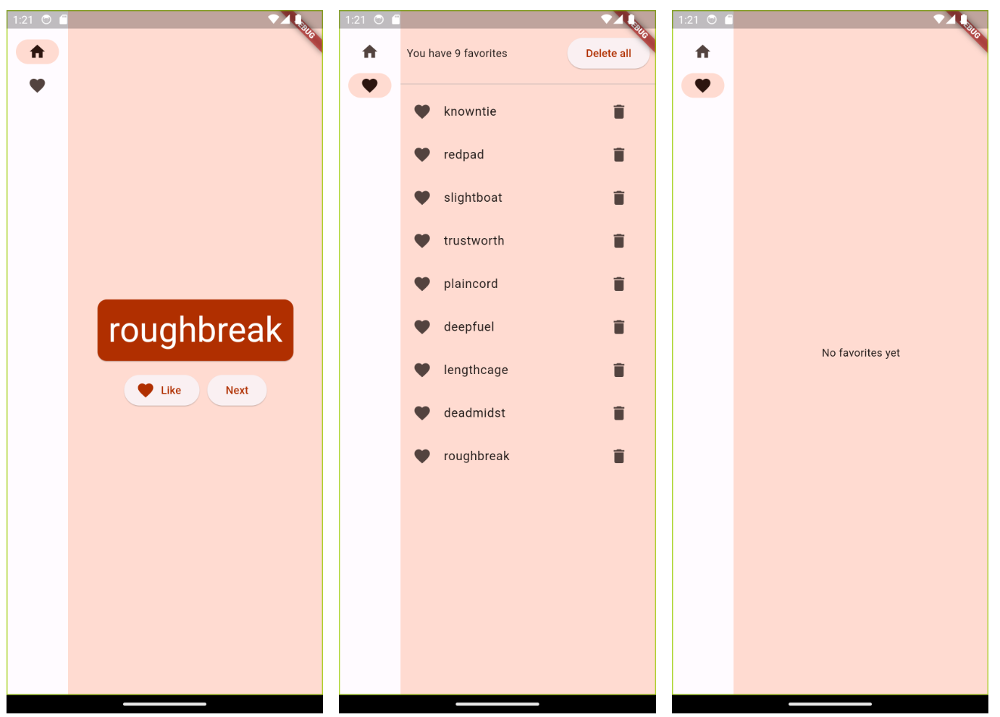

# Namer App

Namer App is a Flutter application that generates cool-sounding names and allows users to favorite them for future reference.

## Features

- Generate unique names with a single tap.
- Favorite the names you like.
- View and manage your list of favorited names.

## Screenshots



## Installation

To run this project locally, follow these steps:

1. Clone this repository to your local machine:

   ```bash
   git clone https://github.com/taham8875/namer-app.git
   ```

2. Navigate to the project directory:

   ```bash
   cd namer-app
   ```

3. Ensure you have Flutter installed. If not, follow the [official Flutter installation guide](https://flutter.dev/docs/get-started/install).

4. Run the app on your preferred device or emulator:

   ```bash
   flutter run
   ```

## Usage

- On the home screen, tap the "Next" button to generate a new name.
- Tap the heart icon to favorite a name.
- Switch to the "Favorites" tab to view your favorited names and delete them if needed.

## Credits

This project was inspired by the [Flutter codelab](https://codelabs.developers.google.com/codelabs/flutter-codelab-first).
